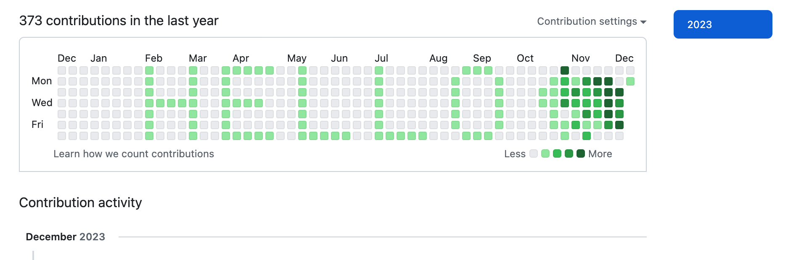
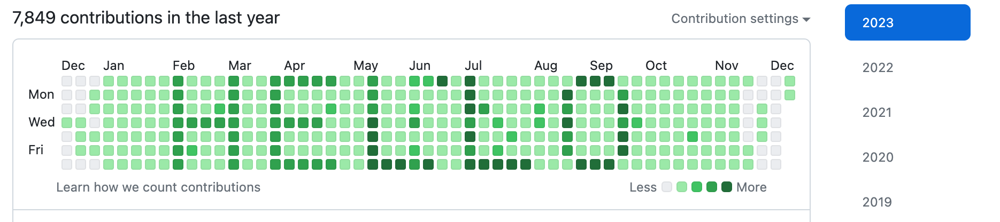

# Contribution painter

Contribution painter is a tool to paint your GitHub contribution graph which is funny but useless(unlike your daily work, which is not funny and useless). :)

## Config
- `git_info.repo_url`: the repo you want to create commits, you can use any repo you want, either a new repo or an existing repo.
- `git_info.gh_token`: your GitHub token, should have `repo` scope.
- `target_letters`: the letters you want to paint, you can use any letters you want, but the letters should be in the range of `a-z` and `A-Z`.
- `font`: the font you want to use, currently only support `75` which means the pixel is 7x5 and `55` which means the pixel is 5x5.
- `background_commits_per_day`: the commits per day for the background.
- `foreground_commits_per_day`: the commits per day for the foreground.
- `leading_columns`: the leading columns before the first letter.

## Usage

1. Clone this repo:    
`git clone git@github.com:qct/contribution-painter.git`
2. Create a new repo on GitHub or use an existing one, this repo will not change your existing commits.
3. Create a config file of your own, you can copy `configs/config.example.yaml` and modify it, you can also use the suggested config from step 3.
   `cp configs/config.example.yaml configs/config.yaml`
4. Get suggested config: this will suggest a `background_commits_per_day` & `foreground_commits_per_day` for you, you can modify them in the config file.   
   `go run main.go --config configs/config.yaml suggest`
5. Paint your contribution graph:   
   `go run main.go --config configs/config.yaml`

## Examples

- Paint `HELLO` in an account with barely no commits

- Paint `HELLO` in an account with some commits, the graph below is exactly painted by this tool in this repo itself. See my [GitHub profile](https://github.com/qct)

